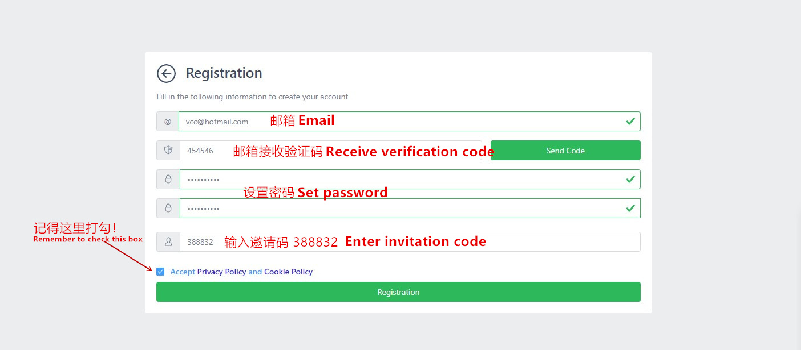
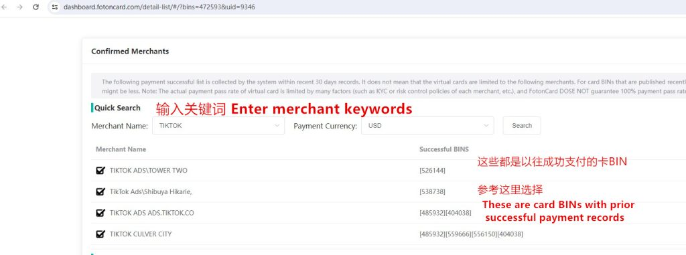
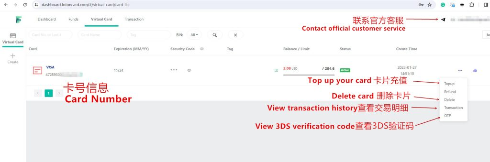

# ফোটনকার্ড ল্যান্ডিং পেজ—`index.html` থেকে রূপান্তরিত README

এই নথিটি একই রিপোজিটরির `index.html` ফাইলের বিষয়বস্তু প্রতিফলিত করে (মেটা ট্যাগ, স্ট্রাকচার্ড ডেটা, স্টাইল ও মূল টেক্সট)।

---

## ডকুমেন্ট তথ্য

| আইটেম | মান |
|--------|-----|
| ভাষা (`lang`) | `bn` |
| শিরোনাম (`<title>`) | ২০২৬ ফেসবুক অ্যাডস ও মিডিয়া বাইয়িং—সেরা ভার্চুয়াল কার্ড \| ফোটনকার্ড |
| ক্যাননিকাল | [https://vccbus.github.io/fotoncardmeng/](https://vccbus.github.io/fotoncardmeng/) |
| মেটা বর্ণনা | ফোটনকার্ড—ফেসবুক অ্যাডস, মিডিয়া বাইয়িং, টিকটক, গুগল অ্যাডসসহ ২০০+ প্ল্যাটফর্মের জন্য নিরাপদ, রিচার্জযোগ্য ভার্চুয়াল ক্রেডিট কার্ড। KYC ছাড়াই, USDT টপ-আপ, BIN বেছে নেওয়া, ১০০ ডলার ফেরতযোগ্য জামানত। ৩ মিনিটে শুরু করুন। |
| ফেভিকন | `./favicon.ico` |
| ওয়েব ফন্ট | Google Fonts—Noto Sans Bengali |

### Open Graph / Twitter (সংক্ষেপ)

- `og:type`: website  
- `og:url` / `twitter:url`: `https://vccbus.github.io/fotoncardmeng/`  
- `og:title` / `twitter:title`: (ঊর্ধ্বে `<title>` এর মতো)  
- `og:image` / `twitter:image`: `https://vccbus.github.io/fotoncardmeng/ft1.jpg`  
- `og:site_name`: FotonCard  
- `twitter:card`: summary_large_image  

---

## স্ট্রাকচার্ড ডেটা (JSON-LD)

```json
{
  "@context": "https://schema.org",
  "@type": "Product",
  "name": "FotonCard ভার্চুয়াল ক্রেডিট কার্ড",
  "image": "https://vccbus.github.io/fotoncardmeng/ft1.jpg",
  "description": "ফেসবুক অ্যাডস, মিডিয়া বাইয়িং, টিকটক, গুগল অ্যাডস, শপিফাই ও ২০০+ প্ল্যাটফর্মের জন্য নিরাপদ, রিচার্জযোগ্য ভার্চুয়াল Visa/Mastercard। KYC প্রয়োজন নেই, USDT টপ-আপ, BIN নির্বাচন ও বাল্ক ইস্যু সাপোর্ট।",
  "brand": {
    "@type": "Organization",
    "name": "FotonCard",
    "url": "https://vccbus.github.io/fotoncardmeng/"
  },
  "offers": {
    "@type": "Offer",
    "url": "https://vccbus.github.io/fotoncardmeng/",
    "priceCurrency": "USD",
    "price": "3.00",
    "priceValidUntil": "2026-12-31",
    "itemCondition": "https://schema.org/NewCondition",
    "availability": "https://schema.org/InStock",
    "seller": {
      "@type": "Organization",
      "name": "FotonCard",
      "url": "https://vccbus.github.io/fotoncardmeng/"
    }
  },
  "aggregateRating": {
    "@type": "AggregateRating",
    "ratingValue": "4.8",
    "reviewCount": "1250"
  }
}
```

---

## এমবেডেড স্টাইল (`<style>`—`index.html` হতে)

```css
:root {
  --primary: #1a73e8;
  --light-bg: #f9f9fb;
  --text: #202124;
  --border: #dadce0;
}
* {
  margin: 0;
  padding: 0;
  box-sizing: border-box;
}
body {
  font-family: "Noto Sans Bengali", "Hind Siliguri", "Kalpurush", -apple-system, BlinkMacSystemFont, "Segoe UI", sans-serif;
  line-height: 1.75;
  color: var(--text);
  background-color: #fff;
  font-size: 16px;
  text-rendering: optimizeLegibility;
  -webkit-font-smoothing: antialiased;
}
.container {
  max-width: 960px;
  margin: 0 auto;
  padding: 0 20px 40px;
}
header {
  text-align: center;
  padding: 40px 0 20px;
}
h1 {
  font-size: 1.65rem;
  font-weight: 700;
  margin-bottom: 20px;
  line-height: 1.45;
}
h2 {
  font-size: 1.3rem;
  margin: 32px 0 16px;
  font-weight: 600;
  line-height: 1.45;
}
h3 {
  font-size: 1.15rem;
  margin: 28px 0 14px;
  font-weight: 600;
  line-height: 1.45;
}
p {
  margin-bottom: 16px;
  font-size: 1rem;
}
strong {
  font-weight: 600;
}
ul, ol {
  margin: 16px 0 16px 1.25rem;
  padding-left: 0.5rem;
}
li {
  margin-bottom: 10px;
  font-size: 1rem;
}
a {
  color: var(--primary);
  word-break: break-word;
}
.btn {
  display: inline-block;
  background-color: var(--primary);
  color: white;
  text-decoration: none;
  padding: 12px 28px;
  border-radius: 6px;
  font-weight: 600;
  font-size: 1rem;
  transition: background-color 0.2s;
}
.btn:hover {
  background-color: #0d5bb8;
}
.btn-center {
  text-align: center;
  margin: 24px 0;
}
img {
  max-width: 100%;
  height: auto;
  display: block;
  margin: 20px auto;
  border-radius: 6px;
  border: 1px solid var(--border);
}
.faq-list {
  margin: 24px 0;
}
.faq-item {
  margin-bottom: 20px;
}
.faq-question {
  font-weight: 600;
  font-size: 1rem;
  color: var(--primary);
  margin-bottom: 6px;
  line-height: 1.5;
}
.faq-item p {
  font-size: 0.95rem;
  line-height: 1.7;
  margin: 0;
}
footer {
  margin-top: 40px;
  text-align: center;
  font-size: 0.9rem;
  color: #5f6368;
}
@media (max-width: 600px) {
  h1 { font-size: 1.4rem; }
  h2 { font-size: 1.2rem; }
  .btn { padding: 10px 20px; font-size: 0.95rem; }
}
```

---

## মূল পেজ বিষয়বস্তু (`<body>`)

### ২০২৬—ফেসবুক অ্যাডস ও মিডিয়া বাইয়িংয়ের জন্য সেরা ভার্চুয়াল কার্ড

### কেন ফোটনকার্ড? ফেসবুক অ্যাডস, অ্যাফিলিয়েট মার্কেটিং ও বিজ্ঞাপনের জন্য

**ফোটনকার্ড** একটি পেশাদার অনলাইন প্ল্যাটফর্ম, যেখানে Mastercard ও Visa ভার্চুয়াল ক্রেডিট কার্ড ইস্যু করা যায়। ই-কমার্স, ফেসবুক বিজ্ঞাপন, পেইড সাবস্ক্রিপশনসহ ব্যবসা ও ব্যক্তিগত ব্যবহারের জন্য অনলাইনে কার্ড তৈরি করতে পারবেন। নিরাপত্তা, গোপনীয়তা ও সুবিধাকে গুরুত্ব দেওয়া হয়।

ফোটনকার্ডের যুক্তরাষ্ট্র, হংকং, সিঙ্গাপুরসহ বিভিন্ন অঞ্চলে ব্যাংকিং পার্টনার ও ডজনখানেক কার্ড BIN রয়েছে—দীর্ঘমেয়াদি ও স্থিতিশীল ভার্চুয়াল ক্রেডিট কার্ড (VCC) সেবার জন্য।

ন্যূনতম কার্ড **ইস্যু ফি মাত্র $3** এবং **লেনদেন ফি ১% থেকে শুরু**—বাল্ক কার্ড ব্যবহারের খরচ কমাতে সাহায্য করে। বড় অঙ্কের কর্পোরেট খরচের জন্য বাল্ক ইস্যু সাপোর্ট রয়েছে।

আন্তর্জাতিক বড় প্ল্যাটফর্মগুলোর সঙ্গে সামঞ্জস্যপূর্ণ। শুধু ইমেইল দিয়ে দ্রুত রেজিস্ট্রেশন ও ৩ মিনিটের মধ্যে কার্ড সক্রিয় করা যায়। স্টেবলকয়েন USDT দিয়ে টপ-আপ এবং KYC পরিচয় যাচাই লাগে না—গোপনীয়তা ও নিরাপত্তা রক্ষায় সহায়ক।

যে মার্চেন্টে পেমেন্ট করা যায় (উদাহরণ): Facebook Ads, TikTok Ads, Google Ads, Microsoft Azure, Shopify, ChatGPT, PayPal, App Store—এবং ২০০+ মার্চেন্ট।

**→ [এখনই সাইন আপ করুন](https://dashboard.fotoncard.com/#/pages/register?agent=388832)**


প্রতিটি কার্ড আলাদাভাবে তৈরি ও নিরাপদভাবে আলাদা রাখা হয়—অনলাইন পেমেন্টের গোপনীয়তা রক্ষায়।

### অনেক ব্যাংকের সঙ্গে কাজ করে—ডজনখানেক কার্ড BIN

বর্তমানে যে BINগুলো তালিকাভুক্ত, তার মধ্যে রয়েছে: 4367, 4725, 5572, 2229, 5295, 5387, 5261, 4181, 4719, 4859, 5319, 5533, 4040, 4411, 5248, 5561, 5596, 4288, 5405, 5567, 5563, 5592, 4503…

প্ল্যাটফর্ম সময়ে সময়ে নতুন BIN যোগ বা পুরনো নিষ্ক্রিয় করে। কোনো নম্বর সক্রিয় না হলে অফিসিয়াল কাস্টমার সার্ভিসে যোগাযোগ করে সক্রিয়করণের অনুমতি চাইতে পারেন।

### ফোটনকার্ড ভার্চুয়াল কার্ড—মূল বৈশিষ্ট্য

1. **মোবাইল/পিসি ম্যানেজমেন্ট:** মোবাইল বা ওয়েব থেকে যেকোনো সময় কার্ড ম্যানেজ করুন। লেনদেনের ইতিহাস দেখুন ও সেটিংস পরিবর্তন করুন।
2. **সেলফ-সার্ভিস ড্যাশবোর্ড:** ম্যানুয়াল রিভিউ কম, কার্ডের ধরন বেছে নিয়ে দ্রুত ইস্যু। সহজ ইন্টারফেস—তাৎক্ষণিক প্রয়োজন মেটায়।
3. **দ্রুত সেটেলমেন্ট:** USDT বা কর্পোরেট অ্যাকাউন্টে জমা—সেকেন্ডের মধ্যে ব্যালেন্স ব্যবহারযোগ্য, দীর্ঘ অপেক্ষা নয়।
4. **ইমেইল নোটিফিকেশন:** পেমেন্ট ও লেনদেনের আপডেট রিয়েল টাইমে—কার্ড অ্যাক্টিভিটি স্বচ্ছভাবে ট্র্যাক করুন।
5. **ব্যবহারবান্ধব ডিজাইন:** পরিষ্কার UI/UX ও ডেটা ভিজুয়ালাইজেশন—নতুনদের জন্যও সহজ।
6. **নিরাপদ পেমেন্ট:** KYC লাগে না, ক্রেডিট চেক নয়—গোপনীয়তা ও অর্থ সুরক্ষিত।

### দীর্ঘমেয়াদি স্থিতিশীল কার্ড সেবা

- ২০৮টি মার্চেন্টে সফল পেমেন্ট
- মোট সফল লেনদেন: $2,567,899
- নিবন্ধিত ব্যবহারকারী: ৩,১২,১২৮
- সফল কার্ড ইস্যু: ৩২,২৫৬

ফোটনকার্ডে ৩ লাখের বেশি নিবন্ধিত ব্যবহারকারী ও $২.৫ মিলিয়নের বেশি সফল লেনদেন—ক্রস-বর্ডার ই-কমার্স, বিজ্ঞাপন ক্যাম্পেইন ও আন্তর্জাতিক পেমেন্টের জন্য কার্যকর সমাধান।

### নিরাপদ ও নমনীয়

**এক কার্ড, এক ব্যবহার (আলাদা অ্যাকাউন্ট):** প্রতিটি প্ল্যাটফর্ম বা অ্যাড অ্যাকাউন্টের জন্য আলাদা ভার্চুয়াল কার্ড—ডেটা আলাদা, প্রতারণার ঝুঁকি কম।

**খরচের সীমা নিয়ন্ত্রণ:** প্রতি লেনদেন বা মাসিক সীমা সেট করুন—অননুমোদিত চার্জ বা অতিরিক্ত খরচ এড়ান।

#### নতুন সুযোগ

- **বিজ্ঞাপন:** ফেসবুক, গুগল, টিকটক অ্যাডসে প্রধান কার্ড লিংক না করেই টপ-আপ। সীমা সেট করে অতিরিক্ত খরচ নিয়ন্ত্রণ করুন।
- **প্ল্যাটফর্ম সাবস্ক্রিপশন:** নেটফ্লিক্স, স্পটিফাই, AI টুলস সাবস্ক্রাইব করুন—মেয়াদ শেষ নিয়ে কম চিন্তা।
- **আন্তর্জাতিক প্ল্যাটফর্মে কেনাকাটা বা জমা:** নমনীয় পেমেন্ট—প্রধান কার্ডের ক্রেডিট লিমিট প্রভাবিত নয়।

### ফোটনকার্ডে কীভাবে রেজিস্ট্রেশন ও অ্যাকাউন্ট খুলবেন?

কম্পিউটার থেকে অফিসিয়াল ওয়েবসাইটে যান: [https://fotoncard.com/](https://fotoncard.com/)। রেজিস্ট্রেশনের সময় অবশ্যই **আমন্ত্রণ কোড 【388832】** দিতে হবে—তবেই প্রক্রিয়া সম্পূর্ণ হবে।

**→ [ফোটনকার্ড রেজিস্ট্রেশন শুরু করুন](https://dashboard.fotoncard.com/#/pages/register?agent=388832)**



### ভার্চুয়াল কার্ড সক্রিয়করণ—ধাপে ধাপে

অ্যাকাউন্ট খোলার পর কার্ড সক্রিয় করতে আগে ব্যালেন্স টপ-আপ করতে হবে। পছন্দের পদ্ধতি বেছে নিন, যেমন:

- কর্পোরেট অ্যাকাউন্ট: USD তে আন্তর্জাতিক ওয়্যার ট্রান্সফার (ক্রেডিটিংয়ের জন্য ম্যানুয়াল রিভিউ, সময় বেশি লাগতে পারে)
- USDT ক্রিপ্টোকারেন্সি টপ-আপ (সাধারণত কয়েক মিনিটের মধ্যে)


প্রথম জমা হিসেবে কমপক্ষে $125 রাখার পরামর্শ দেওয়া হয়।

কার্ড সেগমেন্টের দীর্ঘমেয়াদি স্থিতিশীলতা ও অপব্যবহার রোধে প্ল্যাটফর্মে জামানত (ডিপোজিট) ব্যবস্থা আছে। নতুন ব্যবহারকারীদের কার্ড সক্রিয় করতে প্রথমে $100 জামানত দিতে হয়। ৪৫ দিন পর কার্ডের চার্জব্যাক ও রিফান্ড হার গ্রহণযোগ্য হলে জামানত স্বয়ংক্রিয়ভাবে অ্যাকাউন্ট ব্যালেন্সে ফেরত যায়। সাময়িক অসুবিধা হতে পারে, তবে এটি দীর্ঘমেয়াদি স্থিতিশীলতার জন্য প্রয়োজনীয়। অন্য ভার্চুয়াল কার্ড প্ল্যাটফর্মেও অনুরূপ জামানত দেখা যায়। কার্ড সক্রিয়করণ পেজে জামানত বাটন স্পষ্টভাবে থাকে।


জামানত দেওয়ার পর ভার্চুয়াল কার্ড তৈরি চালিয়ে যেতে পারবেন।

পছন্দের কার্ড BIN বেছে নিয়ে সক্রিয়করণের অঙ্ক দিন—প্ল্যাটফর্ম নির্দিষ্ট সক্রিয়করণ ফি ও টপ-আপ প্রসেসিং ফি নেয়; বাজারের তুলনায় প্রতিযোগিতামূলক।

### মার্চেন্ট লুকআপ—আপনার ব্যবসার জন্য উপযুক্ত BIN বেছে নিন

কোন কার্ড টার্মিনাল আপনার ব্যবসার জন্য ভালো হবে নিশ্চিত না হলে “Confirmed Merchants” ফিচার দিয়ে পেমেন্ট সিনারিও মিলিয়ে খুঁজতে পারেন।


উদাহরণ: টিকটক অ্যাড চালালে কীওয়ার্ডে “TikTok” লিখে দেখুন কোন BINগুলোতে টিকটকে সফল পেমেন্টের রেকর্ড আছে। ফলাফল দেখে সেই BIN বেছে নিন।

এই তথ্য প্ল্যাটফর্ম ব্যবহারকারীদের ঐতিহাসিক পেমেন্ট ডেটা থেকে সংকলিত। ফল বোঝায় অন্য কেউ ওই মার্চেন্টে ওই BIN দিয়ে সফলভাবে পে করেছে—নতুনদের BIN বাছাইয়ে সাহায্য করে। পেমেন্টে অনেক ফ্যাক্টর থাকায় ১০০% সফলতার গ্যারান্টি নয়। ডেটা না থাকলে মানে এই নয় যে BIN ওই মার্চেন্টের জন্য অযোগ্য—ছোট মার্চেন্টে রেকর্ড কম থাকতে পারে।



কার্ড সফলভাবে তৈরি হলে কার্ড নম্বর, মেয়াদ ও সিকিউরিটি কোড দেখে অনলাইন পেমেন্ট করতে পারবেন।

কার্ড সাধারণত সর্বোচ্চ ২ বছর পর্যন্ত বৈধ। মেয়াদের মধ্যে বারবার টপ-আপ করে ব্যবহার করা যায়—জমা, কার্ড মুছে ফেলা, লেনদেন রেকর্ড, 3DS ভেরিফিকেশন কোড ইত্যাদি যেকোনো সময়।




### কার্ড ব্যবহারের নির্দেশনা

- শুধু বৈধ আন্তর্জাতিক অনলাইন পেমেন্ট—ই-কমার্স, বিজ্ঞাপন ও মার্কেটিং, অনলাইন সেবার সাবস্ক্রিপশন ইত্যাদি
- উচ্চ চার্জব্যাক বা উচ্চ রিফান্ড হারের কাজে ব্যবহার নিষিদ্ধ
- ২৪/৭ অনলাইন সাপোর্ট (ব্যাকএন্ড পেজের উপরের ডান কোণে)—যেকোনো সময় জিজ্ঞাসা করুন
- প্রধানত ফেসবুক অ্যাডস ব্যবহার করলে টপ-আপ রেট নিয়ে সাপোর্টের সঙ্গে কথা বলুন; ন্যূনতম ১%
- ফোটনকার্ডের এখনো আলাদা মোবাইল অ্যাপ নেই; মোবাইল ব্রাউজারেও ভালো অভিজ্ঞতা পাওয়া যায়

### ফোটনকার্ড ভার্চুয়াল কার্ড—প্রায়শই জিজ্ঞাসিত প্রশ্ন

#### ফোটনকার্ড কীসের জন্য উপযুক্ত?

মূলত ফেসবুক অ্যাডস, গুগল অ্যাডস, টিকটক অ্যাডস, শপিফাই ও অন্যান্য অ্যাডস মার্কেটিং ও ই-কমার্সের জন্য।

#### রেজিস্ট্রেশনের শর্ত কী?

আমন্ত্রণ কোড অবশ্যই দিতে হবে: **388832**। এটি বাধ্যতামূলক—কোড ছাড়া রেজিস্ট্রেশন সম্পূর্ণ হয় না।

#### ফি কত?

কার্ডের ধরন অনুযায়ী ইস্যু ফি প্রায় $2–$3।

#### কোন ভার্চুয়াল কার্ড পাওয়া যায়?

VISA ও Mastercard। যুক্তরাষ্ট্র, হংকং, সিঙ্গাপুর ও যুক্তরাজ্য থেকে ইস্যু।

#### জমা (ডিপোজিট/টপ-আপ) কীভাবে?

ব্যাংক ট্রান্সফার বা স্বয়ংক্রিয়ভাবে USDT দিয়ে টপ-আপ করা যায়।

#### BIN বেছে নিতে পারব?

হ্যাঁ, বিভিন্ন নম্বর (BIN) সহ অনেক ধরনের কার্ড থেকে বেছে নিতে পারবেন।

#### জামানত (Guarantee Deposit) কেন?

ফোটনকার্ড বড় ব্যাংকের সঙ্গে সরাসরি পার্টনারশিপে Visa/Mastercard ইস্যু করে। তাই কার্ড প্রত্যাখ্যানের হার ২০% এর নিচে রাখতে হয়। ৫ জুলাই ২০২৩ এর আগে এই জামানত নীতি ছিল না—অপব্যবহার ও ঝুঁকি বেড়েছিল। তাই $100 জামানত চালু, ৪৫ দিন পর ফেরত।

#### কতগুলো কার্ড ইস্যু করতে পারব?

শুরুতে $100 জামানত (৪৫ দিন পর অ্যাকাউন্টে ফেরতযোগ্য) দিয়ে ৫–১০টি কার্ড। প্রত্যাখ্যান হার ২০% এর নিচে থাকলে আরও বেশি/প্রায় সীমাহীন ইস্যুর আবেদন করা যেতে পারে।

#### কার্ড আবার লোড করা যায়?

হ্যাঁ—রিচার্জ করে বারবার ব্যবহার করা যায়।

#### কার্ডে বাকি টাকা ফেরত পাব?

হ্যাঁ—কার্ড ডিলিট করলে বাকি ব্যালেন্স অ্যাকাউন্টে ফেরত যায়।

#### একবারে ও মাসিক খরচের সীমা?

BIN অনুযায়ী আলাদা। একবারে সাধারণত $2,000 থেকে $10,000 পর্যন্ত। বিস্তারিত ফোটনকার্ড ড্যাশবোর্ডে কার্ড তৈরির পেজে। মাসিক সীমা জানতে কাস্টমার সার্ভিসে জিজ্ঞাসা করুন।

**→ [এখনই অনলাইনে ভার্চুয়াল কার্ড নিন](https://dashboard.fotoncard.com/#/pages/register?agent=388832)**

ফোটনকার্ড ভার্চুয়াল ক্রেডিট কার্ড বিশ্বের বেশিরভাগ অনলাইন মার্চেন্টে ব্যবহারযোগ্য—ব্যক্তিগত ও ব্যবসায়িক পেমেন্টে নিরাপদ ও সুবিধাজনক। পেমেন্ট সফলতার হার বজায় রাখতে কার্ড নম্বর নিয়মিত আপডেট করা হয়।

---

© ২০২৬ FotonCard। সর্বস্বত্ব সংরক্ষিত।

---

## রিপোজিটরি দ্রুত তথ্য

| ফাইল | বর্ণনা |
|------|--------|
| `index.html` | লাইভ ল্যান্ডিং পেজ (HTML + মেটা + স্টাইল) |
| `README.md` | এই নথি—একই বিষয়বস্তুর Markdown সংস্করণ |
| `favicon.ico` | ফেভিকন |
| `*.jpg` | চিত্র সম্পদ |

**স্থানীয় প্রিভিউ:** `python -m http.server 8080` চালিয়ে `http://localhost:8080` খুলুন।

**GitHub Pages:** [https://vccbus.github.io/fotoncardmeng/](https://vccbus.github.io/fotoncardmeng/)
